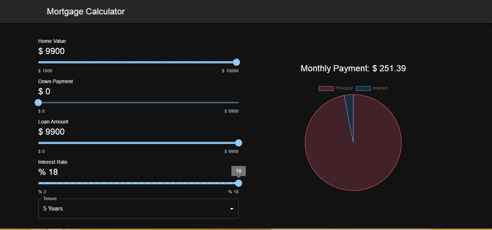
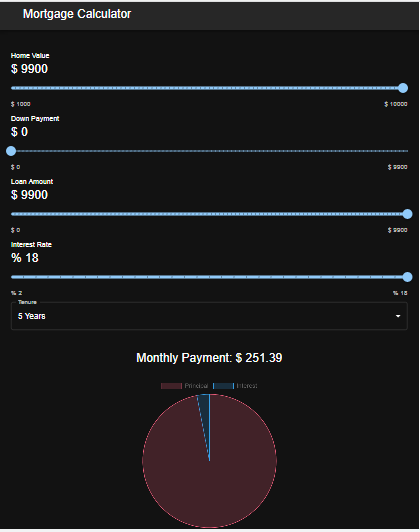

# Mortgage-Calculator

  
  

<!-- TABLE OF CONTENTS -->

# 📗 Table of Contents

- [📖 About the Project](#about-project)
  - [🛠 Built With](#built-with)
    - [Tech Stack](#tech-stack)
    - [Key Features](#key-features)
  - [🚀 Live Demo](#live-demo)
- [💻 Getting Started](#getting-started)
  - [Setup](#setup)
  - [Prerequisites](#prerequisites)
  - [Install](#install)
  - [Usage](#usage)
  - [Run tests](#run-tests)
  - [Deployment](#triangular_flag_on_post-deployment)
- [👥 Authors](#authors)
- [🤝 Contributing](#contributing)
- [⭐️ Show your support](#support)
- [🙏 Acknowledgements](#acknowledgements)
- [📝 License](#license)

# 📖 [Mortgage-Calculator] 

# Webpage to calculate your monthly mortgage payment according to the home value, down payment, interest rate, and amount of years/tenure.  

## 🛠 Built With 

### Tech Stack 

  
Client

  <ul>
    <li>React</li>
  </ul>

  
Client

  <ul>
    <li>Material UI</li>
  </ul>

<!-- Features -->

### Key Features 

- User_can_enter_the_home_value
- User_can_adjust_the_payment_period
- User_can_adjust_the_interest_rate_and_down_payment

(<a href="#readme-top">back to top</a>)

<!-- LIVE DEMO -->
## 🚀 Live Demo 

>You can view the final page [HERE](https://mortgage-d2zf.onrender.com).

(<a href="#readme-top">back to top</a>)

### Prerequisites

In order to run this project you need:
- Install Git in your computer [Git](https://git-scm.com/downloads)
- Any text editor [VSCode](https://code.visualstudio.com/download) 
- Install linters on your local env't
 
### Setup

Clone this repository to your desired folder, access the directory and run the html file: 
To clone: git clone git@github.com:yosefgeda/mortgage-calculator.git
to change to directory: cd mortgage-calculator
Inside you will find the file open it and run npm start.

### Install

Linters have been installed for this project(npm install).
Added a gitignore file and included the node_modules and text.md files.
Linter actions are integreated witg github.

### Usage
execute the following steps:
To run the project you can use the command 'npm start'.

### Deployment
You can view the page by running 'npm start'
Live Link [HERE](https://mortgage-d2zf.onrender.com).

(<a href="#readme-top">back to top</a>)

<!-- AUTHORS -->

## 👥 Authors 

> Mention all of the collaborators of this project.

 **YosefGeda**
- GitHub: [@yosefgeda](https://github.com/yosefgeda)

(<a href="#readme-top">back to top</a>)

<!-- CONTRIBUTING -->
## 🤝 Contributing 

Contributions, issues, and feature requests are welcome!

Feel free to check the [issue page](https://github.com/yosefgeda/mortgage-calculator/issues)

<!-- SUPPORT -->

If you like this project follow and give thumbs up on [linkedin](https://www.linkedin.com/in/yosefgeda)

(<a href="#readme-top">back to top</a>)

<!-- ACKNOWLEDGEMENTS -->

## 🙏 Acknowledgments 

I would like to thank to [Joy Shaheb](https://www.youtube.com/@JoyShaheb).

(<a href="#readme-top">back to top</a>)

## 📝 License 

This project is [MIT](https://github.com/Lornakaboro/Awesome-books/blob/main/LICENSE) licensed.

(<a href="#readme-top">back to top</a>)

